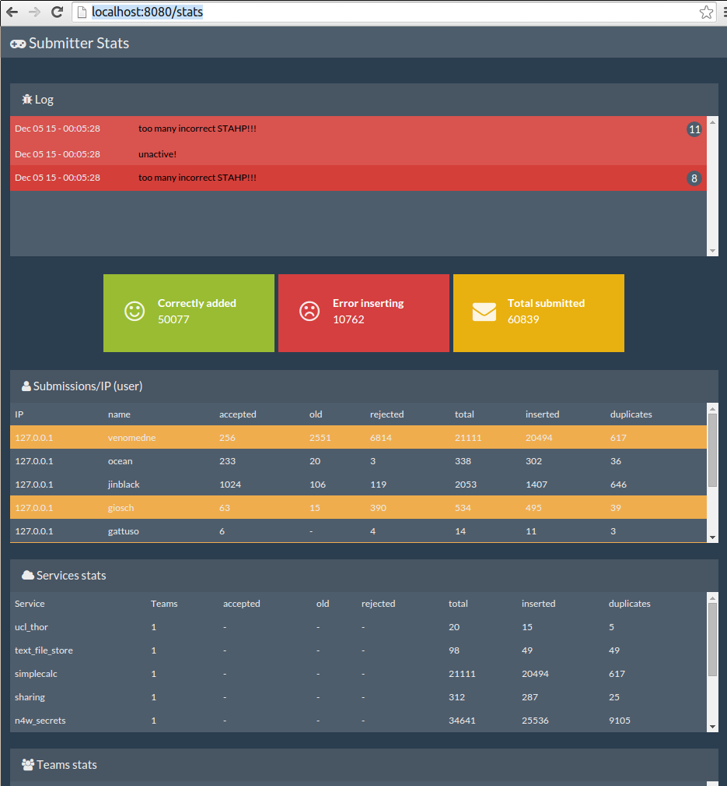

# CTF submitter
While playing ruCTFe 2015 some of our "attack" scripts didn't work as expected, flooding the game infrastructure with invalid flags (sorry guys!).
We decided then to write a centralized "flag submit" service with a rest api which would act as a filter and be able to tell us if some of the scripts attack
scripts are submitting too many invalid flags.
In the end it worked pretty well! :)

Please keep in mind that this code was written in a hurry, planning to use it locally during ctfs: don't expect it to be (perfect || secure || bug free).
If you find a bug, add a new feature please contribute with a pull request (and add your name to the list of contributors!).





# Submitter service

This webservice is responsible for receiving flags, and storing them togheter with statistics inside the DB.
Please start this one first to setup the database the first time.
The service is based on bottle.py and we used cherrypy for our deploy:

```
python submitter.py
```

You will also need an instance of the "worker" which will submit the flags to the game infrastructure:

```
python worker.py
```

## Requirements

+  bottle
+  pymongo>=3.0

for RuCTFe:

+  pwntools

for iCTF:

+  ictf

It was tested with mongodb 2.6.x


## nginx
It is advisable to put an nginx in front of the submitter service, look at ```nginx_submitter.conf``` for an example config.


# Stats service

you will need another virtualenv since right now motor doesn't wrap pymongo 3

```
python stats.py
```

## Requirements

+  tornado
+  motor


# TODO

+ cleanup and "plugin" handling
+ complete service/team statistics
+ management script
+ better log message handling
+ better handling of exceptions around
+ blacklist ip/user temporarily if too many wrong flags are submitted
+ rewrite the stats frontend since it's just plaing jquery
+ reorganize the code base, and allow the stats service and logger to use a different backend other than mongodb
+ add cold restart button in case of failures of the service
+ add a raw socket interface to submit flags
+ possibly add authentication to use the service not only locally
